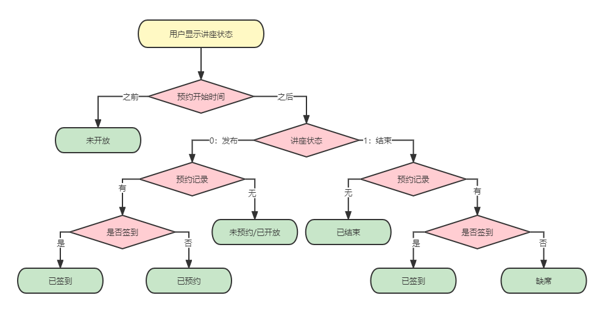
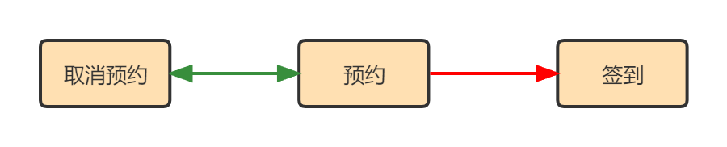

# Lecture — 校园讲座预约系统

## 📚 1 项目简介

Lecture是一款前后端分离的校园讲座预约系统，基于目前主流的技术栈（SpringBoot + MyBatis + MySQL + Redis + RabbitMQ + Spring Security + ...），提供详细的学习开发文档。

登录账号：admin

登录密码：needoffer

## 🎬 2 快速开始

- 配置mysql
  - 修改每一个项目中application.yml中mysql的url, username以及password。
  - 运行db/data.sql添加数据到数据库
- 配置redis
  - 修改每一个项目中application.yml中redis的host, port以及password。
- 启动Nginx
  - 方式1：Window10环境下，并保证所有项目都在该环境下运行时，启动nginx-lecture目录下的niginx.exe
  - 方式2：自定义Nginx，并仿照nginx-lecture/conf/nginx.conf对自己的Nginx进行配置。
- 配置Zookeeper
  - 修改每一个项目中application.yml中zookeeper的ip地址。
- 配置RabbitMQ
  - 修改每一个项目中application.yml中rabbitmq的host, username以及password。
- 配置OSS
  - 修改lecture-oss服务中的application.yml的阿里云OSS配置
- 配置前端
  - 修改`.env.*`中的前端请求路径`VUE_APP_BASE_API`, 即Nginx监听端口。
  
## 💻 3 核心技术栈
后端：
- Spring
- Spring MVC
- Spring Boot 2.2.1.RELEASE
- ORM：MyBatis
- RPC：Dubbo 2.7.8
- 注册中心：Zookeeper
- 数据库：MySQL 8.0
- 缓存：Redis
- 消息队列：RabbitMQ
- 权限：Spring Security

前端：
- Vue 2.6.10
- Node 16.15.0
- 模板：[vue-admin-template](https://github.com/PanJiaChen/vue-admin-template)
- 样式：[element-ui@2.15.7](https://element.eleme.cn/#/zh-CN)

## 🔨 4 开发环境
- 操作系统：Windows 10
- 后端IDE：IDEA
- 前端IDE：VS code
- 构建工具：Apache Maven
- 接口测试工具：Postman
- 压力测试工具：Apache JMeter
- 版本控制工具：Git
- Java 版本：8

## 📑 5 目录结构
```
lecture-system
├── db （数据库脚本）
├── doc （文档相关）
│
├── lecture-common （公共部分）
│   ├── config （配置类）
│   ├── constant （常量）
│   ├── entity （实体类）
│   ├── exception （自定义异常）
│   ├── filter （过滤器）
│   ├── handler （自定义处理器）
│   ├── service （service接口）
│   ├── utils （工具类）
│   └── vo
│
├── lecture-lecture （讲座微服务，核心）
├── lecture-order （讲座预约微服务）
├── lecture-user （用户登录微服务）
├── nginx-lecture （nginx文件）
├── vue-admin-template （前端工程）
│ 
└── README.md
```

## 🌌 6 部署架构

Nginx：通过反向代理访问不同的服务器

前端服务：vue框架搭建的前端项目

微服务：处理各类业务、通过操作redis缓存数据、MySQL存储数据

RabbitMQ：通过消息队列异步解决并发问题

Zookeeper：实现微服务的注册

阿里云OSS：存储用户上传的图片


由于资金问题，实际运行部署情况


本地测试的部署情况


## 📢 7 功能说明

在该系统中分为三个身份：【管理员Admin】、【管理员Manager】和【用户Student】，不同身份有不同的权限，不同的需求和任务。

- 【管理员Admin】拥有发布讲座、修改和签到统计所有讲座的权限；拥有用户管理的权限。
- 【管理员Manager】拥有发布讲座、修改和签到统计他所发布讲座的权限。
- 【用户Student】拥有讲座预约、取消预约的权限。

### 7.1 讲座状态

对于讲座来说，具有两种状态：【0发布】与【1结束】，这两种状态由管理员进行切换。

对于用户来说，每一个讲座都有如下的状态：未开放、未预约（已开放）、已预约、已签到、缺席、已结束。
通过分析讲座预约开始的时间、讲座的状态、预约记录以及预约记录上的签到时间得出这些状态。


### 7.2 用户操作

用户关于讲座的操作包含：

- 评论：在讲座评论区进行留言评论
- 预约讲座：在讲座开始预约后，可以预约讲座

- 取消预约讲座：讲座关闭之前，可以取消预约讲座
- 签到：现场由管理员根据用户提供的用户名完成签到

取消预约和预约之间可以反复操作，一旦完成签到就不能再取消预约了。



## 🎀 8 界面展示

### 8.1 公共界面

🔶 **登录界面**


🔶 **首页**


🔶 **个人中心**


🔶 **评论模块**


### 8.2 Student界面展示

🔶 **讲座列表**


🔶 **讲座详情**


### 8.3 Admin界面展示

🔶 **讲座列表**


🔶 **添加讲座**


🔶 **讲座详情**


🔶 **讲座签到**


🔶 **用户列表**


## 📌 9 功能逻辑图

### 9.1 用户登录模块

用户模块使用Spring Security框架实现认证、授权两大功能。

>认证（Authentication）：验证当前访问系统的是不是本系统的用户，并且确认具体是哪个用户。
> 
>授权（Authoritarian）：经过认证后判断当前用户是否有权限进行某个操作。

#### 9.1.1 认证

认证模块是验证当前访问系统的是不是本系统的用户，并且确认具体是哪个用户。
如果用户未登录就需要让用户先登录再认证。

下图是登录认证模块，使用Spring Security提供的认证逻辑。


#### 9.1.2 授权

#### 9.1.3 Spring Security原理

下面对Spring Security的原理进行简单的介绍：

登录
- 请求携带用户信息请求`/login`接口，在配置类中配置Spring Security对 `/login` 接口进行匿名访问， 所以Spring Security会对`/login`接口放行，之后执行登录业务。
- 登录业务中，使用Spring Security提供的AuthenticationManager进行认证。
- 通过实现UserDetailService接口，重写loadUserByUsername方法，该方法可以从数据库中获取用户信息返回UserDetails对象（LoginUser）。
- 通过继承`DaoAuthenticationProvider`重写`additionalAuthenticationChecks`方法完成自定义密码校验，首先将前端传入的密码进行AES解码获得密码明文，再将密码明文与数据库中的加密密码进行匹配。
- 认证成功后，将用户信息（LoginUser对象）存储在redis中，将userId封装成jwt返回到前端，也就是前端每次访问需要携带的token。

认证
- 所有的请求将经过Spring Security过滤链，过滤链中包含自定义的jwt认证过滤器，可从请求头中获取的token；使用jwt工具将token解析为userId后，从redis中获取用户信息。
- 如果从redis中成功获取LoginUser用户信息，就将该信息存储到SecurityContextHolder中的SecurityContext中的Authentication中，表示当前用户认证通过。
- 如果用户不存在，则返回认证失败的异常。

异常处理
- 认证失败异常，状态码（401）。实现AuthenticationEntryPoint，捕获并处理认证失败的异常。
- 权限不足，状态码（403）。实现AccessDeniedHandler接口，捕获并处理权限不足的异常。


### 9.2 讲座管理模块

#### 9.2.1 讲座列表
支持分页、条件查询所有数据库中的所有讲座。
#### 9.2.2 讲座详情
根据讲座id获取讲座详情，根据讲座id获取预约该讲座的所有用户预约记录。
#### 9.2.3 添加更新讲座
发布讲座或修改讲座，海报的上传需要阿里云的Oss服务。
#### 9.2.4 讲座签到
根据讲座id查询讲座详情，根据讲座id查询所有已签到用户列表。

通过输入用户名并点击签到按钮完成用户的签到，单个用户完成签到后立即刷新签到用户列表。

关闭签到系统后，讲座的状态从【0发布】变为【1结束】，用户预约讲座列表中将无法查询到该讲座，该讲座将无法被预约。

### 9.3 预约讲座模块
#### 9.3.1 讲座列表
支持分页、条件查询所有状态为【0发布】的讲座。

#### 9.3.2 我的讲座
根据已登录用户的id查询所有已预约过的讲座。
#### 9.3.3 预约与取消
讲座预约模块主要实现两个功能： 用户预约讲座、用户取消讲座。

该过程需要lecture-lecture和lecture-order两个微服务共同完成。其中：

预约讲座

- lecture-order微服务：从redis中查询用户是否重复预定讲座、讲座是否还有剩余的可预约数量，
  如果用户未预约该讲座，且该讲座剩余可预约数量大于0，则把讲座id和用户id封装为一个对象发送到消息队列，最后返回前端预约成功。
  
- lecture-lecture微服务：从消息队列中获取消息，操作数据库减少讲座可预约数量，添加用户预约记录；
  操作redis减少讲座可预约数量，添加用户预约记录。

取消预约讲座
- lecture-order微服务：从redis中查询用户是否预约讲座，若用户未预约该讲座则抛出异常；若用户预约该讲座，则远程调用lecture-lecture微服务。
  
- lecture-lecture微服务：查询讲座是否结束，若结束则抛出异常；查询用户是否签到，若签到则抛出异常；删除用户预约记录，
  增加给定id讲座的剩余可预约数量，最后删除redis内用户的预约记录。

流程图如下：


### 9.4 用户列表模块

#### 9.4.1 分页查询

【管理员Admin】可以分页、条件查询数据库中所有用户信息，不包含被逻辑删除的用户；同时可以辑删除用户（数据库is_deleted = 1表示被删除）

#### 9.4.2 添加新用户

填写必要的用户字段添加用户。密码传输经过加密处理。

由于http是明文传输，为了保证密码的安全，前端在传输密码的时候需要对密码进行加密，在后端对密码进行解密，存储到数据库的时候再对密码进行加密。

### 9.5 个人中心

#### 9.5.1 修改密码

输入原密码，填写新密码。密码传输经过加密处理。

#### 9.5.2 修改信息

填写需要修改的字段。

#### 9.5.3 密码加密与传输

由于http是明文传输，为了保证密码的安全，前端在传输密码的时候需要对密码进行加密，在后端对密码进行解密，存储到数据库的时候再对密码进行加密。


数据库中的密码采用加密的方式存储，即使数据库被盗，黑客也不能用密文作为密码进行登录，确保了账号的安全。

### 9.6 评论模块

在数据库中，评论分为两类：父级评论和子级评论，子评论包含指向父评论和根评论的指针。

> 父评论：评论A、评论B、评论C
>
> 子评论：评论B1、评论B2、评论B3、评论1、评论2
>
> 评论2的根评论为评论B，父评论为评论1。


#### 9.6.1 获取评论

根据讲座id获取所有评论，根据评论之间的关系封装好评论数据发给前端。此时，将子评论同级之间进行封装，有利于前端显示。


#### 9.6.2 添加评论

根据讲座id、用户id、父评论id、根评论id和评论内容添加讲座信息。被回复的评论者将收到系统消息（见9.7消息通知）。

#### 9.6.3. 删除评论

根据评论id、用户id删除评论及其子评论。

#### 9.6.4 点赞功能

用户可以在讲座详情页面对每一个评论进行点赞或取消点赞，点赞的数据以set数据结构存储在redis缓存内，键为`commentLikes:讲座id`，值为`用户id`，使用set数据结构可以保证每一个用户只能点赞一次，并且可以快速判断该用户是否点赞以及某一条评论的点赞总数。


### 9.7 消息通知模块


## ⌚ 10 待实现及优化

- [ ] 点赞数据存储到数据库
- [ ] 逐条消费系统消息